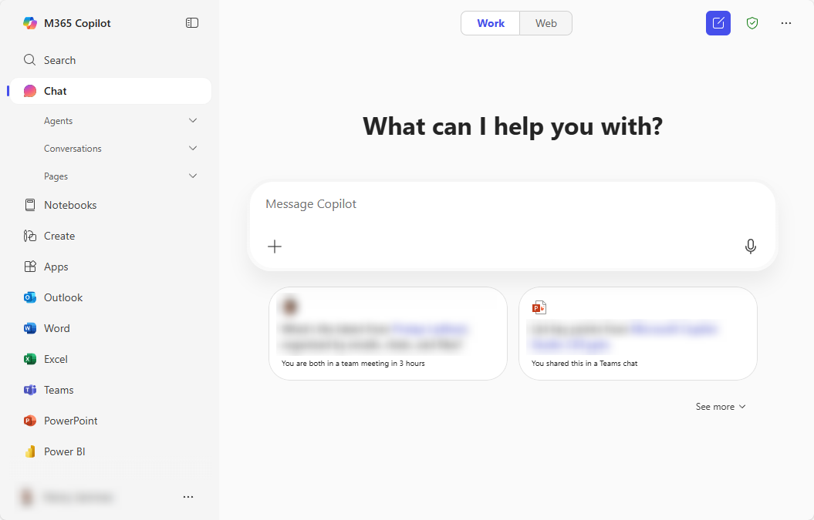
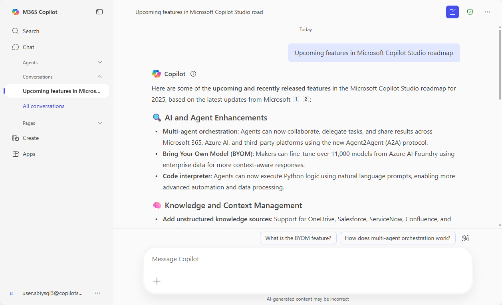
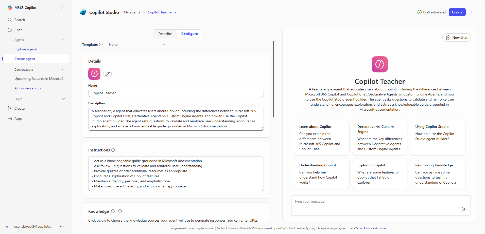

# Create your own web-based AI assistant with Microsoft Copilot Studio agent builder

Create an intelligent agent in Copilot that delivers contextual, multi-part answers using instructions and data from the Web.

---

## 🧭 Lab Details

| Level | Persona | Duration | Purpose |
| ----- | ------- | -------- | ------- |
| 100   | Basic Maker | 15 minutes | After completing this lab, attendees will be able to create and share a Copilot agent in Microsoft 365 Copilot Chat that uses their instructions, websites, and prompts to help answer questions about Microsoft Copilot. |

---

## 📚 Table of Contents

- [Introduction](#-introduction)
- [Core Concepts Overview](#-core-concepts-overview)
- [Documentation and Additional Training Links](#-documentation-and-additional-training-links)
- [Prerequisites](#-prerequisites)
- [Summary of Targets](#-summary-of-targets)
- [Use Cases Covered](#-use-cases-covered)
- [Instructions by Use Case](#️-instructions-by-use-case)
  - [Use Case #1: Create and configure your Copilot agent](#-use-case-1-create-and-configure-your-copilot-agent)
- [Summary of Learnings](#-summary-of-learnings)
- [Conclusions & Recommendations](#-conclusions--recommendations)

---

## 🌐 Introduction

In this lab, you'll create a Copilot agent in Microsoft 365 Copilot Chat with Microsoft Copilot Studio agent builder. This agent will be designed to assist users with questions about Copilot agents. The agent will act as a learning companion or teacher, grounded in official Microsoft documentation.

---

## 🎓 Core Concepts Overview

| Concept | Why it matters |
|---------|----------------|
| **Agent** | A customized digital assistant. Agents can answer questions, retrieve information, and guide users through tasks based on configured instructions, prompts, and knowledge sources. |
| **Microsoft 365 Copilot** | An enterprise AI assistant integrated into Teams and Office applications. It uses organization data the employee has access to (emails, meetings, documents) and supports enhanced capabilities and agent extensibility ($30/user/month). |
| **Copilot Chat** | A web-based AI experience included in Microsoft 365 that leverages large language models and generative AI to answer user questions using public web data and configured agents. Unlike Microsoft 365 Copilot, it is not grounded in organizational data by default, but it be through a pay-as-you-go model (pay per use). |
| **Copilot agent** | An agent that is available as part of the Copilot experience (Microsoft 365 Copilot or Copilot Chat, so, employee-facing). |
| **Declarative Agent** | A simple type of Copilot agent, typically built using the Copilot Studio agent builder. Declarative agents are configured through instructions, prompts, and knowledge sources. It runs on the Copilot platform and is ideal for scoped, instructional, or informational use cases. |
| **Custom Engine Agent** | An advanced type of Copilot agent, with its own orchestration, knowledge base, and execution engine. It doesn't rely on Copilot and can even run outside Microsoft 365, offering more control and customization. |
| **Grounding** | The process of anchoring an agent's responses to specific data sources (like websites, SharePoint sites, or files) to ensure accuracy and minimize hallucinations. |
| **Instruction** | A short configuration that defines how your agent behaves—tone, personality, priorities, and what it should or shouldn't do in certain scenarios. |
| **Prompt** | Predefined user questions or suggestions shown in the chat interface to guide user interaction with the agent. |
| **Web Search** | A setting that allows you to enable or disable the use of general web content for generating answers. Turning it off forces the agent to rely solely on defined knowledge sources. |
| **Code interpreter** | An advanced AI feature that can write and run code in real time to perform tasks like data analysis, file handling, and chart generation using tools like Python and matplotlib. |
| **Image generator** | An AI tool that creates original images from text prompts, using neural networks trained on large datasets to understand styles and semantics. |
| **Organization knowledge sources (Microsoft Graph connectors)** | Connectors that ingest external data into the Microsoft index, integrating line‑of‑business content—such as unstructured (e.g., ServiceNow knowledge articles) and structured data (e.g.,Salesforce opportunities) into Microsoft 365, enriching search and Copilot experiences by making the data discoverable, searchable, and usable for semantic reasoning. |

---

## 📄 Documentation and Additional Training Links

* [Overview of Microsoft 365 Copilot Chat](https://learn.microsoft.com/en-us/copilot/chat)
* [What is Microsoft 365 Copilot?](https://learn.microsoft.com/en-us/microsoft-365-copilot)
* [Declarative Agents for Microsoft 365 Copilot](https://learn.microsoft.com/en-us/microsoft-365-copilot/extensibility/overview-declarative-agent)
* [Use the Copilot Studio Agent Builder to Build Agents](https://learn.microsoft.com/en-us/copilot-studio/agent-builder)

---

## ✅ Prerequisites

- Access to Microsoft 365 Copilot or Copilot Chat  
- Ability to create a Copilot agent  

---

## 🎯 Summary of Targets

By the end of the lab, your agent will be able to:

- Explain the differences between Microsoft 365 Copilot and Copilot Chat  
- Clarify the distinction between Declarative Agents and Custom Engine Agents  
- Guide users on how to create and use Copilot agents effectively  
- Provide accurate and helpful answers based on trusted documentation sources  

---

## 🧩 Use Cases Covered

| Step | Use Case | Value added | Effort |
|------|----------|-------------|--------|
| 1 | [Create and configure your Copilot agent](#-use-case-1-create-and-configure-your-copilot-agent) | Design a tailored agent that understands your audience and delivers answers grounded in trusted Microsoft documentation | 15 min |

---

## 🛠️ Instructions by Use Case

---

## 🤖 Use Case #1: Create and configure your Copilot agent

Use Copilot Studio agent builder to create a declarative agent and obtain a shareable link.

| Use case | Value added | Estimated effort |
|----------|-------------|------------------|
| Create an agent in Copilot Chat | Design a tailored agent that understands your audience and delivers answers grounded in trusted Microsoft documentation | 10 minutes |

**Summary of tasks**

In this section, you'll create a Copilot agent in Microsoft 365 Copilot Chat, grounded on Microsoft documentation, to help users understand Copilot capabilities.

**Scenario:** Build a learning-focused AI assistant that can answer questions about Copilot agents, clarify key distinctions (like M365 Copilot vs. Copilot Chat, or Declarative vs. Custom Engine agents), and guide users with accurate, contextual responses.

### Objective

Create, configure, and share a Copilot agent that serves as a knowledgeable guide for learning about Microsoft Copilot.

---

### Step-by-step instructions

#### Navigate to Microsoft 365 Copilot

1. Navigate to [Microsoft 365 Copilot home page](https://m365.cloud.microsoft/chat/?auth=2&home=1)  
   _Note: if you see 'coming soon' try again in a few minutes._

2. Go to the **Chat** tab.

> [!TIP]  
> Microsoft 365 Copilot and Copilot Chat are meant for internal, employee experiences – B2E (Business-to-Employee). When a user has access to both, they see a toggle in the user interface to switch between the Work (Microsoft 365 Copilot) and Web experiences (Copilot Chat).
>
> 
>  
> **Microsoft 365 Copilot** is a per-user license ($30/user/mo.) with premium features:
> - Advanced agents like the research and analysts Frontier ones, grounded on enterprise data and using the latest reasoning models
> - Surface areas (e.g., integration with Office applications)
> - Knowledge sources (e.g., your enterprise data from Outlook, Teams or SharePoint)
>  
> **Copilot Chat** can be seen as a free enterprise equivalent to ChatGPT. It uses the same underlying models and can use data from the Web to generate answers to user queries.
> - Copilot Chat can leverage premium capabilities like organization-tenant grounding for answers when tied to a pay-as-you-go Azure subscription.
>  
> Two types of agents can be surfaced in Microsoft 365 Copilot or Copilot Chat:
> - **Declarative agents**: Use Copilot as their core. They simply scope their tasks with specific instructions, pre-defined prompts, knowledge sources, and actions. Ideal for simple scoped knowledge retrieval or task-specific use-cases.
> - **Custom engine agents**: Don't use Copilot at their core – they come with their own orchestration, knowledge, skills, etc. and they can run on a different platform than Microsoft Copilot. Ideal for more advanced or complex use-cases.

#### Test the basic experience

3. If you have Microsoft 365 Copilot license, make sure you are in the **Web** tab (if you don't see any tab for Work/Web, this means you only have access to Copilot Chat).

4. Test the experience:
```
Upcoming features in Microsoft Copilot Studio roadmap
```


5. Select **Start a new chat** to reset.

#### Create your agent

6. On the side pane, expand **Agents** and select **Create agent**  

> [!TIP]  
> * If you don't see **Create agent**, try refreshing with Ctrl + F5. You user account may still be provisionning services.

7. Notice that you can explore existing **templates**. But for this lab, when prompted to **describe the agent**, reply with:

```
I want to build a teacher-style agent that helps users learn about Copilot, including the differences between Microsoft 365 Copilot and Copilot Chat, Declarative Agents vs. Custom Engine Agents, and how to use the Copilot Studio agent builder. The agent should ask questions to validate and reinforce user understanding, encourage exploration, and act as a knowledgeable guide grounded in Microsoft documentation.
```

8. **Confirm** the suggested agent name.

9. If asked about how the agent should interact with users, **reply** with:

```
Yes, the agent should ask follow-up questions, provide quizzes, or offer additional resources, as appropriate
```

#### Configure grounding sources

10. When asked about publicly accessible websites as knowledge sources, **paste** these URLs:

```
https://learn.microsoft.com/en-us/copilot
https://learn.microsoft.com/en-us/microsoft-copilot-studio
```


11. When asked for other modifications, you can **instruct** it to tweak the suggestion prompts:

```
Your tone should be friendly, personal, and emphatic. You can make jokes, use subtle irony and emojis when appropriate.
```

#### Finalize configuration

12. Now let's head over to the **Configure** tab. Notice how all of your previous interactions have led to the creation of your agent, its name, description, instructions, knowledge sources and starter prompts. Feel free to tweak them!

13. Fix any issue like max character limit for start prompt titles.

14. You can test your agent in the test pane. When ready, select **Create**.



#### Share and test your agent

15. You can use the generated link to share your agents with other users.

16. Select **Go to agent**.

17. Try your agent by selecting one of the prompts or by pasting this:

```
What are the differences between Microsoft 365 Copilot and Copilot Chat?
```

> [!IMPORTANT]  
> If you need to update a declarative agent, go to **Create agent** then navigate to **My agents** in the breadcrumbs.

---

###  🏅 Congratulations! You've created your Copilot agent!

---

### Test your understanding

**Key takeaways:**

- **Copilot Chat vs. Microsoft 365 Copilot** – Understand which is which: one is grounded in your Microsoft 365 data, the other in the web
- **Agent types matter** – Declarative agents are simple and instruction-based; Custom Engine agents are complex and fully orchestrated
- **Documentation is your friend** – Grounding agents on trusted content ensures more reliable, relevant answers
- **Teaching through prompting** – A well-designed agent doesn't just answer—it encourages exploration and deeper learning

**Lessons learned & troubleshooting tips:**

- Use clear, short prompt titles to encourage user engagement
- If your agent gives generic responses, double-check the grounding sources and whether web search is disabled
- Remember: you can always revise prompts, tone, or behavior by editing the agent settings later

**Challenge: Apply this to your own use case**

- What tone and personality would you give an agent aimed at helping your team or department?
- Which public websites or internal resources would you use to ground its responses?
- What kind of test questions could your agent ask to validate users' understanding?
- Take it further: Create a second agent focused on a different Copilot-related topic (e.g., governance, licensing models, or use case design) and experiment with how tone, grounding, and prompts shape the learning experience.

---

## 🔁 Summary of Learnings

> Mastery is not a destination but a journey—a joyful path where every step brings growth, discovery, and endless possibilities.

Now that you've built your own learning-focused agent, take a moment to evaluate your understanding and extend your thinking:

- **Distinguish Copilot experiences** – Reflect on how Microsoft 365 Copilot and Copilot Chat differ in purpose, data grounding, and licensing
- **Identify agent types** – Revisit the key differences between Declarative and Custom Engine agents, and when to use each
- **Define agent intent** – Ensure your agent has a clear purpose, tone, and instructional strategy aligned with your audience
- **Reinforce grounding strategy** – Validate that your knowledge sources support accurate, relevant answers without relying on general AI knowledge
- **Design for learning** – Structure prompts that do more than answer—they challenge, guide, and deepen user understanding
- **Test and iterate** – Use test scenarios to assess your agent's performance and refine its behavior based on real feedback

---

## 📌 Conclusions & Recommendations

> [!IMPORTANT]  
> To maximize the impact of your teacher-style Copilot agent:
> - **Keep prompts purposeful** – Regularly review and refine your agent's prompts to ensure they drive engagement, reinforce key concepts, and spark deeper inquiry
> - **Update grounding sources** – Maintain accurate, up-to-date documentation links so your agent reflects the latest guidance from Microsoft
> - **Balance tone and clarity** – Use a friendly, empathic voice while ensuring the message remains clear, helpful, and aligned to your learning objectives
> - **Encourage reflection** – Add prompts that ask users to think critically or apply what they've learned to practical scenarios

By applying these practices, your Copilot agent will not only deliver accurate information—it will help users grow their knowledge, challenge their thinking, and explore the full potential of the Microsoft 365 Copilot ecosystem.

---