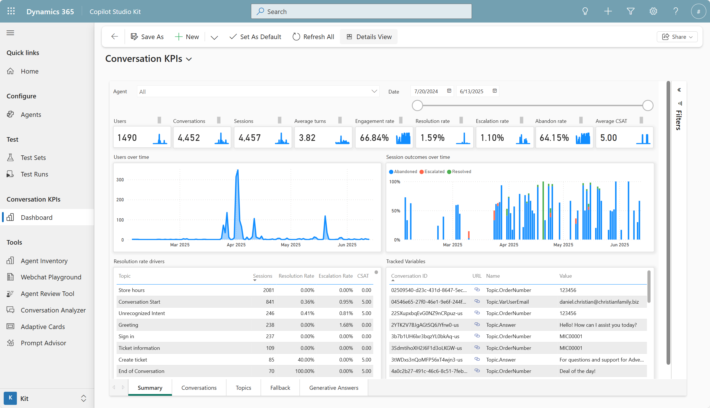
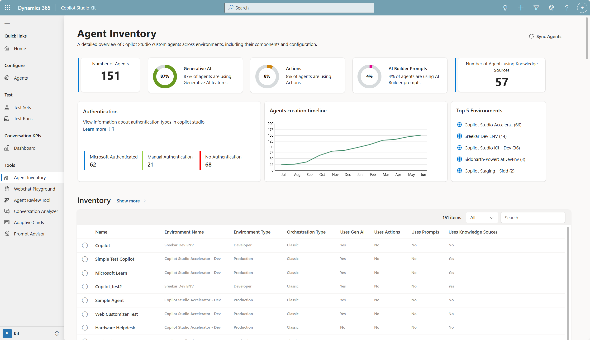
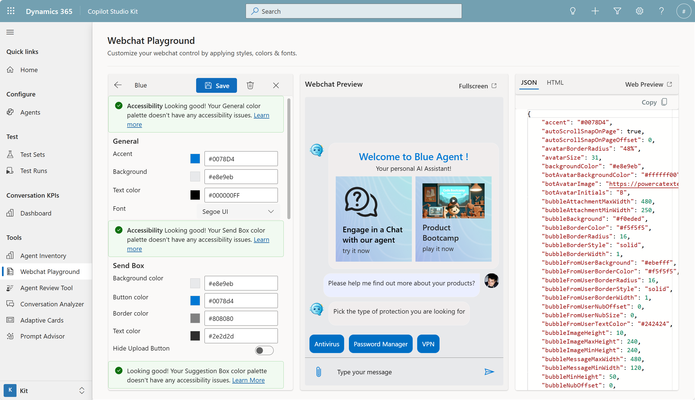
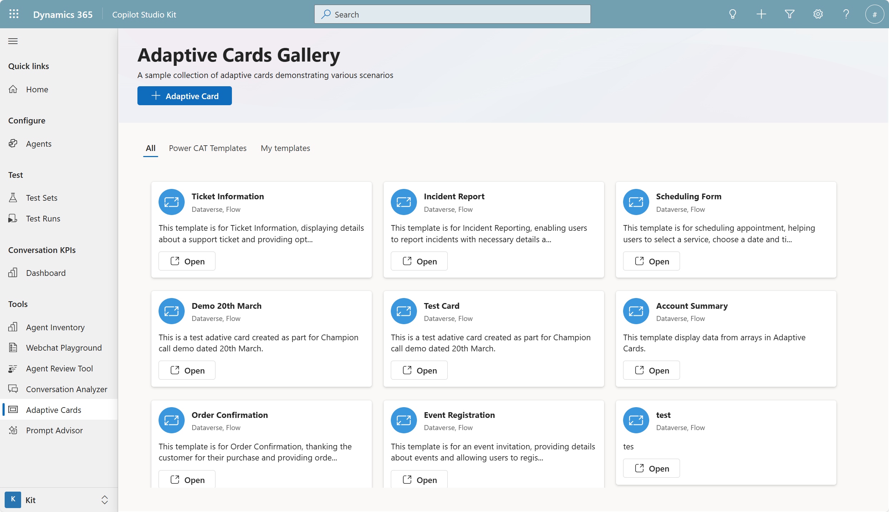

# Testin| Level | Persona | Duration | Purpose |
| ----- | ------- | -------- | ------- |
| 200 | | 2 | [Execute and Analyze Test Results](#-use-case-2-execute-and-analyze-test-results) | Delivers actionable insights for agent performance optimization | 20 min |
| 3 | [Explore Advanced Kit Features](#-use-case-3-explore-advanced-kit-features) | Discovers comprehensive toolkit capabilities for enhanced agent development | 20 min |eveloper/Maker | 60 minutes | After completing this lab, participants will be able to configure automated testing for Copilot Studio agents, create comprehensive test suites, analyze agent performance through systematic validation, and explore the full ecosystem of Power CAT tools for agent development. Gain expertise in quality assurance practices and advanced tooling for AI-powered conversational agents. |opilot Studio Agents with Power CAT Kit - Automate Quality Assurance for AI Agents

Build confidence in your AI agents through automated testing and validation workflows.

---

## 🧭 Lab Details

| Level | Persona | Duration | Purpose |
| ----- | ------- | -------- | ------- |
| 200 | Developer/Maker | 30 minutes | After completing this lab, participants will be able to configure automated testing for Copilot Studio agents, create comprehensive test suites, and analyze agent performance through systematic validation. Gain expertise in quality assurance practices for AI-powered conversational agents. |

---

## 📚 Table of Contents

- [Why This Matters](#-why-this-matters)
- [Introduction](#-introduction)
- [Core Concepts Overview](#-core-concepts-overview)
- [Documentation and Additional Training Links](#-documentation-and-additional-training-links)
- [Prerequisites](#-prerequisites)
- [Summary of Targets](#-summary-of-targets)
- [Use Cases Covered](#-use-cases-covered)
- [Instructions by Use Case](#️-instructions-by-use-case)
  - [Use Case #1: Configure Agent Testis](#-use-case-1-configure-agent-testing-infrastructure)
  - [Use Case #2: Execute and Analyze Test Results](#-use-case-2-execute-and-analyze-test-results)
  - [Use Case #3: Explore the other Copilot Studio Kit features](#-use-case-3-explore-the-other-copilot-studio-kit-features)

---

## 🤔 Why This Matters

**Makers and Developers** - Worried about deploying AI agents that might give inconsistent or incorrect responses to users?

Think of testing a chatbot like quality control in manufacturing:
- **Without systematic testing**: Agents deployed with unknown behavior, potential for embarrassing mistakes, and no confidence in responses
- **With automated testing**: Validated agent performance, consistent quality assurance, and data-driven optimization insights

**Common challenges solved by this lab:**
- "How do I know if my agent is giving good answers?"
- "I need to test multiple scenarios without manually chatting hundreds of times"
- "My agent works sometimes but fails on edge cases I didn't think of"
- "I want to track performance improvements over time"

**Spend 30 minutes now to save hours of manual testing and avoid costly production issues later.**

---

## 🌐 Introduction

Quality assurance for AI agents requires a systematic approach that goes beyond manual testing. The Power CAT Copilot Studio Kit provides enterprise-grade testing capabilities that enable makers to validate agent behavior at scale.

**Real-world example:** A customer service organization deploys a Copilot Studio agent to handle common inquiries about product returns. Without proper testing, the agent might incorrectly handle edge cases like partial returns or international shipping, leading to frustrated customers and escalated support tickets. With automated testing, they can validate hundreds of scenarios before deployment and catch issues early.

This lab teaches you to implement professional testing practices that ensure your agents deliver consistent, reliable experiences to end users.

---

## 🎓 Core Concepts Overview

| Concept | Why it matters |
|---------|----------------|
| **Agent Configuration** | Defines the connection between your Copilot Studio agent and the testing framework, enabling automated interactions and response validation |
| **Test Sets and Test Cases** | Structured collections of scenarios that systematically validate agent behavior across different conversation patterns and edge cases |
| **Test Types** | Different validation approaches (exact match, generative AI analysis, topic detection) that ensure comprehensive coverage of agent capabilities |
| **Test Runs and Analytics** | Execution framework that provides detailed performance metrics, response analysis, and trending data for continuous improvement |

---

## 📄 Documentation and Additional Training Links

* [Power CAT Copilot Studio Kit Documentation](https://aka.ms/CopilotStudioKit)

---

## ✅ Prerequisites

* Access to a Microsoft Copilot Studio environment with agent creation permissions.
* Access to the Power CAT Copilot Studio Kit (installed from AppSource or GitHub).

---

## 🎯 Summary of Targets

In this lab, you'll establish a comprehensive testing framework for Copilot Studio agents. By the end of the lab, you will:

* Set up agent configuration in the Copilot Studio Kit.
* Create structured test sets with multiple validation scenarios including exact matches and AI-powered response analysis.
* Execute automated test runs and interpret detailed insights.
* Explore other features of the kit.

---

## 🧩 Use Cases Covered

| Step | Use Case | Value added | Effort |
|------|----------|-------------|--------|
| 1 | [Configure Agent Tests](#-use-case-1-configure-agent-tests) | Establishes automated testing pipeline for systematic agent validation | 10 min |
| 2 | [Execute and Analyze Test Results](#-use-case-2-execute-and-analyze-test-results) | Delivers actionable insights for agent performance optimization | 10 min |
| 3 | [Explore the other Copilot Studio Kit features](#-use-case-3-explore-the-other-copilot-studio-kit-features) | Beyond testing, the Power CAT Copilot Studio Kit includes powerful tools for real-world deployment and governance: conversation KPIs for tracking agent performance, SharePoint synchronization for auto-updating knowledge bases, the Webchat Playground for UI customization, and the Adaptive Cards Gallery for rich interactions. It also offers admin tools like Agent Inventory for environment-wide visibility and the Agent Review Tool to detect issues and anti-patterns—helping makers ship secure, scalable, and effective agents. | 10 min |

---

## 🛠️ Instructions by Use Case

---

## 🧱 Use Case #1: Configure Agent Tests

Set up the foundational components needed to automate testing of your Copilot Studio agents.

| Use case | Value added | Estimated effort |
|----------|-------------|------------------|
| Configure Agent Testing Infrastructure | Establishes automated testing pipeline for systematic agent validation | 20 minutes |

**Summary of tasks**

In this section, you'll learn how to configure an external-facing agent for testing, connect it to the Power CAT Copilot Studio Kit, and create comprehensive test scenarios.

**Scenario:** You're a maker responsible for a customer support agent that handles product inquiries. Before deploying to production, you need to ensure the agent responds appropriately to various customer questions and edge cases.

### Objective

Configure a Copilot Studio agent for external access and integrate it with the Power CAT testing framework to enable automated validation.

---

### Step-by-step instructions

#### Access the Copilot Studio Kit application

1. **Start** by accessing the Copilot Studio Kit application, either installed in your organization or the one that was setup for the training.

> [!IMPORTANT]
> - To access this app, use the provided URL in the **Lab Resources** (specific per training).

2. The first time you open the app, you will be prompted to allow Copilot Studio Kit to access your data. Select **Allow** to grant permissions.

#### Create an agent configuration

3. Go to **Agents** in the left navigation menu.

4. Select **New**

5. **Name** it `Nova AI` and select **Test Automation** as **Configuration Type**.

6. To obtain the **Token Endpoint**, you need to navigate to your **Nova AI** agent, go to **Channels**, select **Direct Line Speech**, and copy the **Token Endpoint** URL. Paste this URL into the **Token Endpoint** field in the Copilot Studio Kit.

> [!TIP]
> The **tokent endpoint** allows to obtain a token that can be used to initiate a conversation with the agent programmatically. This is essential for automated testing frameworks to interact with your agent. Once the token is obtained, it can be used to send messages to the agent and receive responses from the **Direct Line API**.

> [!IMPORTANT]
> Using "No authentication" is suitable for agents that do not access sensitive internal information. It allows anyone to interact with your agent, so use it cautiously.

7. Select **Save and close** to create the agent configuration.

#### Create a Test Set

11. **Navigate** to **Test Sets** and click **New** to create a new test set for your agent.

12. **Name** the test set `Nova AI Test Set` and **Save**.

13. You can now add **+ New Agent Test** in the subgrid.

| Test Set Name | Type | Test Utterance  | Expected Response |
| ------------- | ---- | --------------- | ----------------- |
| `TST-001` | **Exact Match** | `Hi!` | `Hello, how can I help you today?` |
| `TST-002` | **Generative Answer** | `What caused the fall of the Roman Empire?` | `The fall of the Roman Empire was a gradual process driven by internal issues like political instability and economic decline, and external pressures such as barbarian invasions and climate change.` | 

> [!TIP]
> You can either add each test individually, or toggle the subgrid view to **Export/Import View** and select selecting `⋮` **Export Agent Tests** > **Export Agent Tests in Excel Online**. This makes it very convenient to create or update multiple tests at once, especially for larger test sets.

---

###  🏅 Congratulations! You've completed Agent Testing Infrastructure Setup!

---

### Test your understanding

**Key takeaways:**

* **Authentication Configuration** – Setting "No authentication" enables automated testing but should only be used for external-facing agents without sensitive data access. It is possible to confiure authentication for internal agents, but this requires additional setup.
* **Token Endpoints** – These URLs provide programmatic access to your agent and are essential for automated testing frameworks
* **Test Set Design** – Comprehensive test suites include exact matches, AI-powered analysis, and topic validation to ensure thorough coverage

**Lessons learned & troubleshooting tips:**

* If the token endpoint doesn't work, ensure your agent is fully published and the authentication settings are saved
* Test with simple questions first before creating complex multi-turn scenarios
* Remember that "No authentication" agents are publicly accessible, so avoid including sensitive test data

**Challenge: Apply this to your own use case**

* What types of questions do your users most commonly ask that you should include in test cases?
* How would you structure test scenarios to cover both happy path and error handling situations?
* What metrics would be most valuable for measuring your agent's success in your specific business context?

---

---

## 🔄 Use Case #2: Execute and Analyze Test Results

Run your configured tests and interpret the results to optimize agent performance and ensure quality.

| Use case | Value added | Estimated effort |
|----------|-------------|------------------|
| Execute and Analyze Test Results | Delivers actionable insights for agent performance optimization | 10 minutes |

**Summary of tasks**

In this section, you'll learn how to execute test runs, analyze detailed results including response quality and performance metrics, and use insights for continuous improvement.

**Scenario:** Your test infrastructure is configured and you need to validate your agent's performance across multiple scenarios. You want to establish baseline metrics and identify areas for improvement before full deployment.

### Step-by-step instructions

#### Execute Test Runs

1. **Navigate** to **Test Runs** in the Copilot Studio Kit and click **New** to create a new test execution.

2. **Name** it `Nova AI Test Run 01`

3. **Select** the **Agent Configuratio**n** and **Agent Test Set** configured in the previous use case.

4. **Save** the test run to initialize it.

> [!TIP]
> Test runs can take several minutes depending on the number of test cases and agent response times. You can monitor progress in real-time.

#### Analyze Test Results and Performance Metrics

5. **Review the Test Run Results** page which displays comprehensive analytics including:
   - Overall pass/fail rates for your test set
   - Individual test case results with actual vs. expected responses
   - Response latency measurements for performance optimization
   - Detailed AI analysis scores for generative response tests

6. **Examine failed test cases** by clicking on individual results to understand why responses didn't meet expectations.

> [!IMPORTANT]
> Pay special attention to tests that fail due to response quality rather than exact matching. These often indicate opportunities for prompt optimization or knowledge base improvements.

#### Optimize Based on Insights

7. **Identify patterns in test failures** such as:
   - Specific topic areas where the agent struggles
   - Response time issues that might impact user experience
   - Inconsistent handling of similar questions

8. **Document recommended improvements** based on test results, such as:
   - Knowledge base updates for failed content questions
   - Prompt engineering adjustments for better response quality
   - Additional training data needs for improved accuracy

> [!TIP]
> Create a feedback loop by implementing improvements in your agent, then re-running the same test set to measure progress over time.

---

###  🏅 Congratulations! You've completed Test Execution and Analysis!

---

### Test your understanding

* How do the different test types (exact match vs. generative AI analysis) provide complementary insights into agent performance?
* What patterns in test results would indicate that your agent needs additional training data versus prompt optimization?
* How could you use test results to demonstrate ROI and continuous improvement to business stakeholders?

**Challenge: Apply this to your own use case**

* Set up a regular testing schedule that aligns with your agent development and deployment cycles
* Create test scenarios that reflect your actual user conversations and business requirements
* Establish key performance indicators (KPIs) based on test results that align with your business goals

---

---

## 🎨 Use Case #3: Explore Advanced Kit Features

Discover the comprehensive ecosystem of tools available in the Power CAT Copilot Studio Kit for enhanced agent development and management.

| Use case | Value added | Estimated effort |
|----------|-------------|------------------|
| Explore Advanced Kit Features | Discovers comprehensive toolkit capabilities for enhanced agent development | 10 minutes |

**Summary of tasks**

In this section, you'll explore the full range of capabilities beyond testing, including conversation analytics, SharePoint integration, UI customization, and administrative tools.

**Scenario:** You've successfully implemented testing for your agents and want to understand what other capabilities are available to enhance your agent development lifecycle, improve user experience, and streamline administrative tasks.

### Step-by-step instructions

#### Explore Conversation KPIs and Analytics

1. **Navigate to Conversation KPIs** in the Power CAT Kit to explore advanced analytics capabilities that complement Copilot Studio's built-in analytics.

2. **Review the dashboard features** that provide aggregated conversation data in Dataverse, making it easier to understand conversation outcomes without analyzing complex transcripts.

    

    

> [!TIP]
> Conversation KPIs simplify performance tracking by providing structured data that can be easily exported and analyzed in Power BI or other reporting tools.

#### Review Governance Tools

3. **Explore Agent Inventory** which provides administrators with a tenant-wide view of all Copilot Studio agents, including usage patterns and configuration details.

    

#### Investigate User Experience Tools

4. **Visit the Webchat Playground** to explore visual customization options for your agent's chat interface, including colors, fonts, and branding elements.

    

5. **Examine the Adaptive Cards Gallery** which provides pre-built templates for rich interactive responses that enhance user engagement.

> [!TIP]
> Use the Webchat Playground to generate HTML with custom styles that match your organization's branding guidelines.

---

###  🏅 Congratulations! You've explored the full Power CAT Copilot Studio Kit ecosystem!

---

### Test your understanding

* How do the various tools in the kit complement each other to provide a complete agent development lifecycle?
* Which administrative tools would be most valuable for maintaining governance and security in a large organization?
* How could you integrate these capabilities into your existing development and deployment processes?

**Challenge: Apply this to your own use case**

* Identify which additional kit features would provide the most value for your specific agent development scenarios
* Plan how you could incorporate conversation KPIs and analytics into your ongoing agent optimization process
* Consider how administrative tools could help you scale agent development across your organization while maintaining quality and security standards

## 🏆 Summary of learnings

True learning comes from doing, questioning, and reflecting—so let's put your skills to the test.

To maximize the impact of automated agent testing and the Power CAT ecosystem:

* **Comprehensive Test Coverage** – Include exact matches, AI-powered analysis, and edge cases to ensure thorough validation of agent behavior across all scenarios
* **Regular Testing Cycles** – Establish automated testing as part of your development workflow to catch issues early and track improvements over time
* **Data-Driven Optimization** – Use test results and conversation KPIs to make informed decisions about prompt engineering, knowledge base updates, and conversation flow improvements
* **Performance Monitoring** – Track response times and quality metrics to ensure your agent meets both functional and performance requirements
* **Ecosystem Integration** – Leverage the full range of kit capabilities including SharePoint synchronization, UI customization, and administrative tools for comprehensive agent lifecycle management
* **Governance and Security** – Use administrative tools like Agent Inventory and Agent Review Tool to maintain standards and security across your organization's agent portfolio

---

### Conclusions and recommendations

**Copilot Studio Kit golden rules:**

* Test early and test often - integrate automated testing into your development workflow from the beginning
* Cover both happy paths and edge cases - real users will ask unexpected questions that reveal gaps in agent training
* Use multiple test types for comprehensive validation - combine exact matching with AI-powered analysis for complete coverage
* Monitor performance trends over time - establish baselines and track improvements as you optimize your agent
* Implement proper governance - use the inventory tools to maintain security, compliance, and quality standards across all agents
* Document and share results - use test data and analytics to build confidence with stakeholders and guide business decisions
* Maintain test sets as living documents - update scenarios based on real user interactions and changing business needs

By following these principles, you'll deliver reliable, high-quality conversational AI experiences that consistently meet user expectations and business objectives while maintaining proper governance and security standards across your organization's agent portfolio.

---