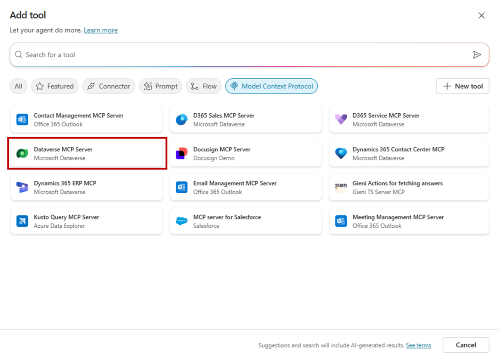
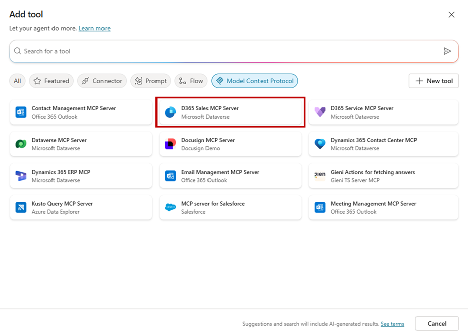
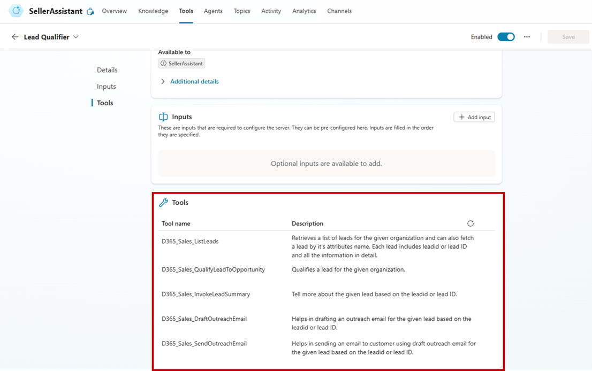
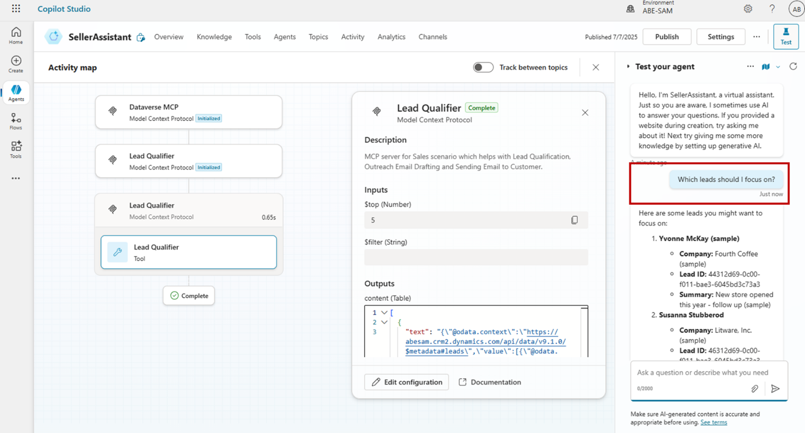
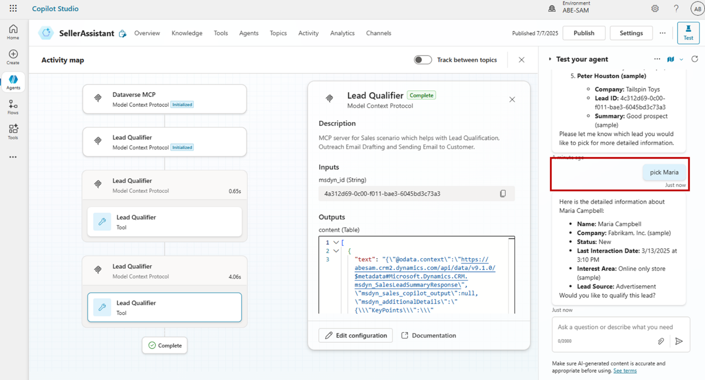
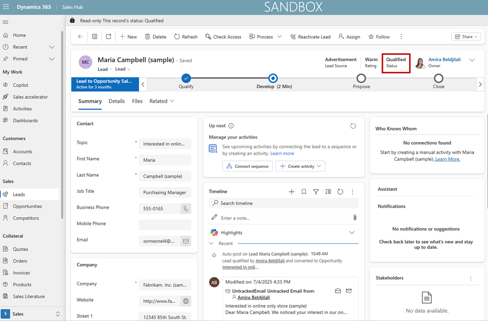

# Prioritize Hot Leads with AI: Connect to Dynamics 365 Sales Using Model Context Protocol

Empower sellers to focus on what matters most—high-value leads.

---

## 🧱 Lab Details

| Level | Persona         | Duration   | Purpose                                                                                                                                                                                                                                                                                                                                                                    |
| ----- | --------------- | ---------- | -------------------------------------------------------------------------------------------------------------------------------------------------------------------------------------------------------------------------------------------------------------------------------------------------------------------------------------------------------------------------- |
| 200   | Maker/Developer | 15 minutes | After completing this lab, participants will be able to connect to Dynamics 365 Sales with Model Context Protocol to identify and prioritize high-value leads, enabling sellers to focus their time and effort where it counts most. You’ll learn how to configure the Model Context Protocol, connect to Dynamics 365 Sales, and use AI to analyze and qualify leads. |

---

## 📚 Table of Contents

- [Why This Matters](#-why-this-matters)
- [Introduction](#-introduction)
- [Core Concepts Overview](#-core-concepts-overview)
- [Documentation and Additional Training Links](#-documentation-and-additional-training-links)
- [Prerequisites](#-prerequisites)
- [Summary of Targets](#-summary-of-targets)
- [Use Cases Covered](#-use-cases-covered)
- [Instructions by Use Case](#️-instructions-by-use-case)
  - [Use Case #1: Create and Configure an Agent](#-use-case-1-create-and-configure-an-agent)
  - [Use Case #2: Configure Model Context Protocol (Dataverse and D365 Sales)](#-use-case-2-configure-model-context-protocol-dataverse-and-d365-sales)
  - [Use Case #3: Test the Complete Workflow](#-use-case-3-test-the-complete-workflow)

---

## 🤔 Why This Matters

**For sales leaders and CRM admins** - Lead overload is a common problem.

Think of a sales team like a firefighter squad:

- **Without AI prioritization**: They’re chasing every alarm, wasting time and missing real fires.
- **With AI prioritization**: They focus on the biggest, hottest leads – fast and smart.

**Common challenges solved by this lab:**

- "We’re missing hot leads because we can’t triage fast enough."
- "Our sellers are overwhelmed with too many low-priority leads."
- "We need a smarter way to focus our sales efforts."

**In just 15 minutes, you’ll learn how to use AI to help your sales team work smarter—not harder.**

---

## 🌐 Introduction

In today’s competitive sales environment, identifying and acting on the right leads at the right time is critical. Sellers are often overwhelmed by the volume of leads and lack the tools to quickly determine which ones are worth pursuing.

**Real-world example:** A sales team receives hundreds of leads per week. Without automation, they spend hours reviewing CRM data. As a result, some of the best opportunities are missed or delayed.

With D365 Sales Model Context Protocol and AI: AI analyzes lead data, engagement history, and contextual signals to surface the most promising leads. Sellers get a prioritized list—no guesswork, no delay.

---

## 🎓 Core Concepts Overview

| Concept                               | Why it matters                                                                                                                                  |
| ------------------------------------- | ----------------------------------------------------------------------------------------------------------------------------------------------- |
| **Model Context Protocol**            | Enables AI to securely access tools, data, and prompts through a standard protocol                                                              |
| **D365 Sales Model Context Protocol** | Enables AI to access and reason over CRM data in Dynamics 365 Sales, surfacing insights like lead quality, engagement level, and deal potential |

---

## 📄 Documentation and Additional Training Links

- [Microsoft Copilot Studio Documentation](https://learn.microsoft.com/en-us/copilot-studio/overview)
- [Extend your agent with Model Context Protocol](https://learn.microsoft.com/en-us/copilot-studio/extend-agent-model-context)
- [Connect to Dataverse with Model Context Protocol](https://learn.microsoft.com/en-us/power-apps/maker/data-platform/connect-model-context)
- [Connect to Dynamics 365 Sales with Model Context Protocol (preview)](https://learn.microsoft.com/en-us/power-apps/maker/data-platform/connect-d365-sales-model-context)

---

## ✅ Prerequisites

- Access to Microsoft Copilot Studio with appropriate licensing.
- Office 365 environment.
- Access to a Dynamics 365 Sales environment.

---

## 🎯 Summary of Targets

In this lab, you'll build a complete lead prioritization workflow that transforms how sellers in your organization identify and act on high-value opportunities. By the end of the lab, you will:

- Create and configure an agent.
- Configure Dataverse Model Context Protocol and Dynamics 365 Sales Model Context Protocol.
- Test the complete workflow from leads detection to lead qualification.
- Understand how AI can automate lead prioritization.

---

## 🧰 Use Cases Covered

| Step | Use Case                                                                                                                              | Value added                                                                                      | Effort |
| ---- | ------------------------------------------------------------------------------------------------------------------------------------- | -------------------------------------------------------------------------------------------------- | ------ |
| 1    | [Create and configure an agent](#-use-case-1-create-and-configure-an-agent)                                                           | Establishes the foundation for intelligent lead processing and workflow orchestration              | 5 min  |
| 2    | [Configure Model Context Protocol (Dataverse and D365 Sales)](#-use-case-2-configure-model-context-protocol-dataverse-and-d365-sales) | Enables AI to analyze CRM data in Dynamics 365 Sales and identify high-value leads                 | 5 min  |
| 3    | [Test the Complete Workflow](#-use-case-3-test-the-complete-workflow)                                                                 | Validates the end-to-end solution and ensures reliability in real-world sales environments         | 5 min  |

---

## 🛠️ Instructions by Use Case

---

## 🧱 Use Case #1: Create and Configure an Agent

Set up the foundational agent

| Use case | Value added | Estimated effort |
|----------|-------------|------------------|
| Create and configure an agent | Establishes the foundation for intelligent lead processing and workflow orchestration | 5 minutes |

**Summary of tasks**

In this section, you'll learn how to create a seller experience agent that helps sellers interact through a chat interface.

**Scenario:** Your sales team is overwhelmed with incoming leads and needs quick, intelligent guidance on which ones to focus on.

### Objective

Create a seller-facing agent.

---

### Step-by-step instructions

#### Creating the Agent and Solution Setup

1. Navigate to the Copilot Studio home page at https://copilotstudio.microsoft.com/
2. Go to the **Solutions** menu.
3. Select the existing solution used in prior labs.
4. Select **New** > **Agent**.
5. Click **Skip to configure**.
6. Name the agent **Seller Assistant**.
7. Click **Create**.

> [!TIP]
> Choose a descriptive name to make your agent easier to find and manage.

---

### 🏅 Congratulations! You've completed Use Case #1!

### Test your understanding

**Key takeaways:**

* **Seller Assistant Agent Foundation** – You've created the structure for intelligent seller interactions.
* **Solution Integration** – Your agent is inside a solution for organized deployment.

**Lessons learned:**
* Keep agent names clear and purpose-driven.

---

## ↺ Use Case #2: Configure Model Context Protocol (Dataverse and D365 Sales)

Transform your agent by connecting it to Dataverse and D365 Sales via Model Context Protocol.

| Use case | Value added | Estimated effort |
|----------|-------------|------------------|
| Add Dataverse and D365 Sales MCP tools | Connects Dynamics 365 Sales via Model Context Protocol for intelligent, sales-specific conversational experiences. | 5 minutes |

**Summary of tasks**

You’ll configure MCP tools to allow AI to surface prioritized leads.

**Scenario:** Sellers face a long list of leads. The agent helps them find the most promising ones.

### Step-by-step instructions

#### Adding Dataverse MCP Server

1. Go to the **Tools** tab in your agent.
2. Click **+ Add a tool** > choose **Model Context Protocol** > select **Dataverse MCP server**.

3. Click **Add and configure**.
4. Rename the tool to **Dataverse MCP**.
5. Under **Additional details**, set **Authentication** to **No, pass through tool owner's credentials**.
6. Click **Save**.

> [!TIP]
> Dataverse MCP is needed before configuring D365 Sales MCP.

#### Adding D365 Sales MCP Server

1. Add a second MCP tool.
2. Select **D365 Sales MCP server**.

3. Click **Add and configure**.
4. Rename to **Lead Qualifier**.
5. Update description: *Support identifying and focusing on high-potential leads.*
6. Set **Authentication** to **No, pass through tool owner's credentials**.
7. Click **Save**.
8. Review the tools associated.



#### Configuring Agent Instructions

1. Navigate to **Overview > Instructions**.
2. Paste these instructions:

```
When the user says they want to see leads they should focus on:
- Retrieve and present 3–5 leads: name, company, lead ID, summary

When user says "pick one":
- Confirm selection
- Show details: name, company, status, interaction, interest
- Ask to qualify

When user says "qualify it":
- Do not request lead ID again
- Qualify the lead
- Ask to draft follow-up email

General:
- Always confirm intent
- Offer quick replies
- Ask before proceeding
- Be brief, helpful, and friendly
```

3. Publish the agent.

---

### 🏅 Congratulations! You've completed Use Case #2!

---

## 🧪 Use Case #3: Test the Complete Workflow

| Use case                | Value added                                                                                      | Estimated effort |
| ---------------------- | -------------------------------------------------------------------------------------------------- | ---------------- |
| Test the complete workflow | Validates the end-to-end solution and ensures reliability in real-world sales environments         | 5 minutes        |

**Summary of tasks**

You’ll test your configured agent by simulating a realistic sales interaction.

**Scenario:** A seller logs into the agent and asks which leads to focus on. The agent should respond with prioritized suggestions and support lead qualification.

### Step-by-step instructions

1. Send the prompt: **Which leads should I focus on?**

2. Pick a lead from the list using the prompt: **Pick Maria**

3. Send **Yes** to qualify the selected lead.

4. Check if the lead status is updated in CRM.


> [!IMPORTANT] Verify in CRM that the lead was correctly qualified through your agent interaction.

---

### 🏅 Congratulations! You've completed Use Case #3!

### Test your understanding

**Key takeaways:**

- **End-to-end validation** – You confirmed that the agent supports triage, interaction, and qualification.
- **Seller experience simulation** – The agent guides users naturally using AI-driven logic.

**Challenge: Apply this to your own use case**

- What refinements would make the interaction more natural?
- How could the agent support follow-up actions (emails, tasks)?

---

## 🏆 Summary of learnings

To maximize the impact of AI in sales workflows:

- **Start Simple, Scale Smart** – Begin with triage, then expand.
- **Data Quality Drives Results** – Ensure CRM hygiene.
- **Design for Real-World Use** – Match how sellers actually work.
- **Iterate Based on Feedback** – Improve your agent over time.

---

### Conclusions and recommendations

**Seller Assistant Success Principles:**

- Test your agent using realistic scenarios.
- Keep D365 Sales data clean.
- Use secure authentication.
- Match the agent to how sellers work.
- Expand use over time (qualification, outreach).
- Monitor usage and iterate regularly.

By following these principles, you'll empower your sellers to focus where it counts, using AI that works the way they do.

---